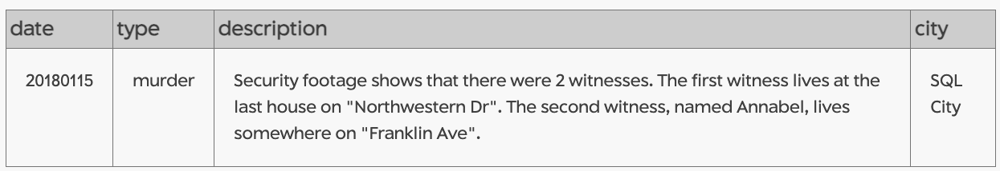

# SQL Practice Exercises

## Table of Contents
- [The SQL Murder Mystery](#the-sql-murder-mystery)
- [Next Practice](#installation)


## The SQL Murder Mystery

Spoiler: If you want to try the exercise, do not read beyond this point and go to the original [source](https://mystery.knightlab.com/).
The SQL Murder Mystery was created by Joon Park and Cathy He while they were Knight Lab fellows. See the [GitHub repository](https://github.com/NUKnightLab/sql-mysteries) for more information.


<details>
  <summary>Click the arrow to see my thought process, SQL queries, and outputs</summary>

   <br>
   
#### Initial clues 
The crime was a **​murder**​ that occurred sometime on ​**Jan.15, 2018**​ and that it took place in ​**SQL City**​.
   
#### Databse schema


 

#### Read crime report

   ```sql
SELECT *
FROM crime_scene_report
WHERE city = "SQL City" 
AND date = 20180115
AND type ="murder";         
```




#### Gather information from witnesses
  
   ```sql
-- One lives on  last house on "Northwestern Dr"
SELECT *
FROM person
WHERE address_street_name = "Northwestern Dr"
ORDER BY address_number DESC
LIMIT 1;
```


   ```sql
-- Secod witness, “Annabel” lives on “Franklin Ave”
SELECT *
FROM person
WHERE name  like "A%"
AND address_street_name = "Franklin Ave";
```


#### Read the police report of each witness

   ```sql
SELECT p.id, p.name, i.transcript
FROM person AS p
INNER JOIN interview AS i 
ON p.id = i.person_id
WHERE p.name IN ("Morty Schapiro", "Annabel Miller")
```


**New clues**

| Witness Name     | Observation (clues)                                                                                       |
|------------------|--------------------------------------------------------------------------------------------------|
| Morty Schapiro  | Car with a plate that included "H42W"               |
| Morty Schapiro   | Killer had "Get Fit Now Gym" bag                                                                 |
| Morty Schapiro   | The membership number on the bag started with "48Z"                                               |
| Annabel Miller    | She recognized the killer from her gym when working out last week on January 9th|


We have two leads: the gym and car leads

#### Gym lead

   ```sql
SELECT m.name,c.membership_id,m.membership_start_date, c.check_in_date,
c.check_in_time, c.check_out_time
FROM get_fit_now_member AS m
INNER JOIN get_fit_now_check_in AS c
ON m.id = c.membership_id
WHERE c.check_in_date = 20180109 AND
c.membership_id LIKE '48Z%'
```


#### Car lead

 ```sql
SELECT p.id, p.name, d.age, d.height,
d.eye_color, d.hair_color, d.gender,
d.plate_number, d.car_make, d.car_model
FROM person AS p
INNER JOIN drivers_license AS d 
ON p.license_id = d.id
WHERE p.name IN ("Joe Germuska", "Jeremy Bowers")
AND plate_number LIKE '%H42W%';
```


#### Who paid the killer?
 
 ```sql

--Read crime report

SELECT p.id, p.name, i.transcript
FROM person AS p
INNER JOIN interview AS i 
ON p.id = i.person_id
WHERE p.name = "Jeremy Bowers"
```


 ```sql

--Find the brains behind the crime using the clues from the report

SELECT p.name, d.height, d.hair_color, d.gender,
d.car_make, d.car_model,f.event_name, f.date
FROM person AS p
INNER JOIN drivers_license AS d ON p.license_id = d.id
INNER JOIN facebook_event_checkin AS f ON p.id = f.person_id
WHERE gender = "female" 
AND height BETWEEN 65 AND 67
AND hair_color = "red"
AND car_make = "Tesla"
AND car_model = "Model S"
```


</details>

## Next practice 
Coming soon.


